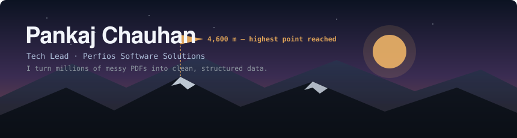
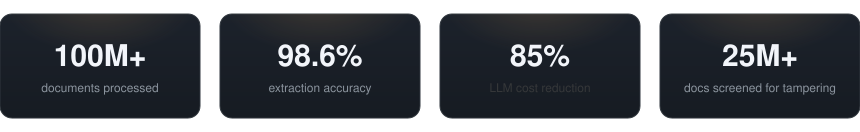

<div align="center">



<a href="https://pankaj-sde.pages.dev/"></a>
&nbsp;
<a href="https://www.linkedin.com/in/pankaj-chauhan-sde/"></a>
&nbsp;
<a href="mailto:pankajchauhan.nitsri@gmail.com"></a>
&nbsp;
<a href="https://pankaj-sde.pages.dev/resume.pdf"></a>

</div>

---

### `~/whoami`

```json
{
  "name":     "Pankaj Chauhan",
  "role":     "Tech Lead",
  "company":  "Perfios Software Solutions",
  "location": "Dehradun, India · Perfios New Delhi (hybrid)",
  "focus":    ["Agentic AI", "Data Mining", "LLM pipelines", "Fraud forensics", "Python Development"],
  "off_duty": "Altitude trekking — highest point 4,600 m",
  "mantra":   "Planning an expedition is a lot like planning a release."
}
```

I build scalable backend systems for fintech, where the core problem is turning millions of complex PDFs and images into clean, structured data. Lately my work has shifted toward applied AI inside enterprise systems — LLMs, RAG, and agentic workflows powering risk products that are smarter and far cheaper to run.

---

### 📌 Pinned

<!--START_SECTION:pinned-repos-->
| Repo | Description | Stack | ⭐ |
| :-- | :-- | :-- | --: |
| [**DrawHunt**](https://github.com/PankajChauhanji/DrawHunt) | draw the word and guess game. | JavaScript | 3 |
| [**SuperSevenCards**](https://github.com/PankajChauhanji/SuperSevenCards) | Super seven cards game. | Python | 3 |
| [**my_portfolio**](https://github.com/PankajChauhanji/my_portfolio) | My Portfolio | HTML | 2 |
| [**cricket-analysis-prediction**](https://github.com/PankajChauhanji/cricket-analysis-prediction) | — | Jupyter Notebook | 3 |
| [**ocr-string-similarity**](https://github.com/PankajChauhanji/ocr-string-similarity) | Image Similarity Matching | Jupyter Notebook | 3 |
| [**line_encoder**](https://github.com/PankajChauhanji/line_encoder) | Implementing the line encoding schemes | Python | 4 |
<!--END_SECTION:pinned-repos-->

---

### 📈 Activity & Stats

<div align="center">

<picture>
  <source media="(prefers-color-scheme: dark)" srcset="https://raw.githubusercontent.com/PankajChauhanji/PankajChauhanji/output/github-contribution-grid-snake-dark.svg" />
  <source media="(prefers-color-scheme: light)" srcset="https://raw.githubusercontent.com/PankajChauhanji/PankajChauhanji/output/github-contribution-grid-snake.svg" />
  
</picture>

<br><br>


<br>


<br><br>


</div>

---

<div align="center">



</div>

---

### The ascent — where I've shipped

| Role | Focus | When |
| :-- | :-- | --: |
| **Tech Lead** · Perfios | DGFT trade-risk pipeline — daily court-judgment analysis, multi-stage OCR + prompt engineering to classify complex legal risk | Apr 2026 – present |
| **Senior Member of Technical Staff** · Perfios | Corporate Entities Risk platform (10K docs/day) · FIR extraction at national scale · table extraction across 10M+ records | Apr 2024 – Apr 2026 |
| **Software Engineer II** · Perfios | Industry-first PDF tampering detection (1.5M+ docs) · generic parser-utility framework at 98.6% accuracy | Apr 2022 – Apr 2024 |
| **Software Engineer** · Karza Technologies | Low-latency KYC parser APIs · Google & Azure OCR · 40% latency reduction | Jun 2021 – Apr 2022 |
| **Software Development Intern** · SmartServ | SQL/MongoDB migrations · React & jQuery front-end features | Jan 2021 – Jun 2021 |

---

### 🎓 Education

<div align="center">


</div>

**National Institute of Technology, Srinagar** — *B.Tech, Information Technology* · 2017 – 2021

---

### The kit

**Languages**
&nbsp;


**Generative AI & RAG**
&nbsp;


**Data mining & extraction**
&nbsp;


**Web & infra**
&nbsp;


---

### A system I've built — Corporate Entities Risk Platform

<div align="center">


</div>

One of several platforms I've built at Perfios. It continuously crawls open-source news into MongoDB, cleans and de-noises the stream, then detects relevant businesses using NLP and an ensemble classifier. From there, LLMs extract and filter the entities, profile each one for risk, and stitch the results back into a central entities database — turning a firehose of raw news into structured, queryable risk intelligence.

---

<details>
<summary><b>🏔️  Away from the keyboard</b></summary>

<br>

Long approaches and quiet summits in the Himalaya are how I reset — highest point reached so far is **4,600 m**. Planning an expedition turns out to be a lot like planning a release: load light, plan the route, respect the conditions, and keep moving.

</details>

<details>
<summary><b>📜  Certifications</b> — IBM / Coursera</summary>

<br>

- [RAG and Agentic AI](https://coursera.org/share/920288b8a01f570be6ecc0c0f108cb7f) — Specialization
- [Generative AI for Software Developers](https://coursera.org/share/e677124390f6b70b9dbe6f23f8863d3a) — Specialization
- [Advanced RAG with Vector Databases & Retrievers](https://coursera.org/share/847e231943eb0f614734b41fd800d220)
- [Agentic AI with LangGraph, CrewAI, AutoGen & BeeAI](https://coursera.org/share/a06e4ae58ee07e980be718acfb1511f7)
- [Build AI Agents using MCP](https://coursera.org/share/fc5f79e74ba8998e5e94e338fa0ab702)
- [Build Multimodal Generative AI Applications](https://coursera.org/share/b778bd48faea85c520e96ec494e67bac)

</details>

---

### Trailhead

Open to interesting problems in **data extraction**, **agentic AI**, and **backend engineering**.

📍 Dehradun · Perfios New Delhi (hybrid) &nbsp;·&nbsp; 🔗 [Portfolio](https://pankaj-sde.pages.dev/) &nbsp;·&nbsp; 💼 [LinkedIn](https://www.linkedin.com/in/pankaj-chauhan-sde/) &nbsp;·&nbsp; ✉️ pankajchauhan.nitsri@gmail.com
