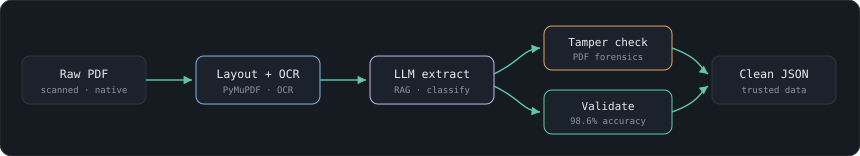

<div align="center">


<a href="https://pankaj-sde.pages.dev/"></a>
<a href="https://www.linkedin.com/in/pankaj-chauhan-sde/"></a>
<a href="mailto:pankajchauhan.nitsri@gmail.com"></a>
<a href="https://pankaj-sde.pages.dev/resume.pdf"></a>

</div>

---

### `~/whoami`

```json
{
  "name":     "Pankaj Chauhan",
  "role":     "Tech Lead",
  "company":  "Perfios Software Solutions",
  "location": "Dehradun, India · Perfios New Delhi (hybrid)",
  "focus":    ["Agentic AI", "Data Mining", "LLM pipelines", "Fraud forensics", Python Development],
  "off_duty": "Altitude trekking — highest point 4,600 m",
  "mantra":   "Planning an expedition is a lot like planning a release."
}
```

I build scalable backend systems for fintech, where the core problem is turning millions of complex PDFs and images into clean, structured data. Lately my work has shifted toward applied AI inside enterprise systems — LLMs, RAG, and agentic workflows powering risk products that are smarter and far cheaper to run.

---

<div align="center">


</div>

---

### The ascent — where I've shipped

| Role | Focus | When |
| :-- | :-- | --: |
| **Tech Lead** · Perfios | Corporate Risk platform (10K docs/day) · DGFT trade-risk pipeline · FIR extraction at national scale · table extraction across 10M+ records | Apr 2024 – present |
| **Software Engineer II** · Perfios | Industry-first PDF tampering detection (1.5M+ docs) · generic parser-utility framework at 98.6% accuracy | Apr 2022 – Apr 2024 |
| **Software Engineer** · Karza Technologies | Low-latency KYC parser APIs · Google & Azure OCR · 40% latency reduction | Jun 2021 – Apr 2022 |
| **Software Development Intern** · SmartServ | SQL/MongoDB migrations · React & jQuery front-end features | Jan 2021 – Jun 2021 |

*B.Tech, Information Technology — National Institute of Technology, Srinagar (2017–2021)*

---

### The kit

**Languages**
&nbsp;


**Generative AI & RAG**
&nbsp;


**Data mining & extraction**
&nbsp;


**Web & infra**
&nbsp;


---

### A system I've built

<div align="center">



</div>

The extraction pipeline behind the fintech work — layout-aware parsing and OCR feeding an LLM stage for classification, with a forensic tamper check and validation pass before anything is trusted as clean data.

---

<details>
<summary><b>🏔️  Away from the keyboard</b></summary>

<br>

Long approaches and quiet summits in the Himalaya are how I reset — highest point reached so far is **4,600 m**. Planning an expedition turns out to be a lot like planning a release: load light, plan the route, respect the conditions, and keep moving.

</details>

<details>
<summary><b>📜  Certifications</b> — IBM / Coursera</summary>

<br>

- [RAG and Agentic AI](https://coursera.org/share/920288b8a01f570be6ecc0c0f108cb7f) — Specialization
- [Generative AI for Software Developers](https://coursera.org/share/e677124390f6b70b9dbe6f23f8863d3a) — Specialization
- [Advanced RAG with Vector Databases & Retrievers](https://coursera.org/share/847e231943eb0f614734b41fd800d220)
- [Agentic AI with LangGraph, CrewAI, AutoGen & BeeAI](https://coursera.org/share/a06e4ae58ee07e980be718acfb1511f7)
- [Build AI Agents using MCP](https://coursera.org/share/fc5f79e74ba8998e5e94e338fa0ab702)
- [Build Multimodal Generative AI Applications](https://coursera.org/share/b778bd48faea85c520e96ec494e67bac)

</details>

---

### Trailhead

Open to interesting problems in **data extraction**, **agentic AI**, and **backend engineering**.

📍 Dehradun · Perfios New Delhi (hybrid) &nbsp;·&nbsp; 🔗 [Portfolio](https://pankaj-sde.pages.dev/) &nbsp;·&nbsp; 💼 [LinkedIn](https://www.linkedin.com/in/pankaj-chauhan-sde/) &nbsp;·&nbsp; ✉️ pankajchauhan.nitsri@gmail.com
